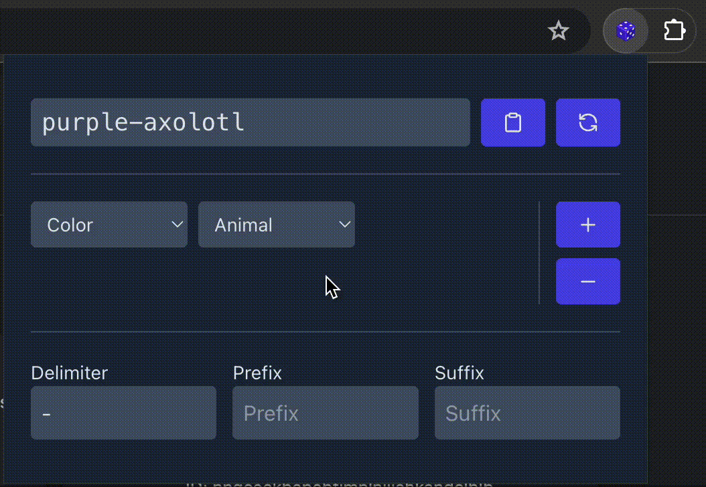

# Dice Roll

Chrome extension for generating randomized, human readable strings for naming
test data.

To use locally:

1. Install workspace dependencies with `pnpm install` at the root
2. Run the extension locally with `pnpm dev`.
3. Navigate to `chrome://extensions` in the browser
4. Click "Load Unpacked", then select the `dist` directory of this workspace.

Built using https://github.com/Jonghakseo/chrome-extension-boilerplate-react-vite
